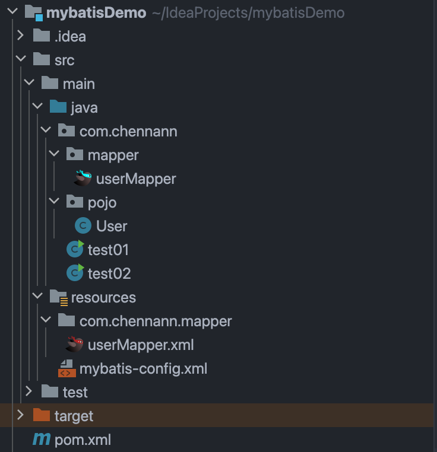
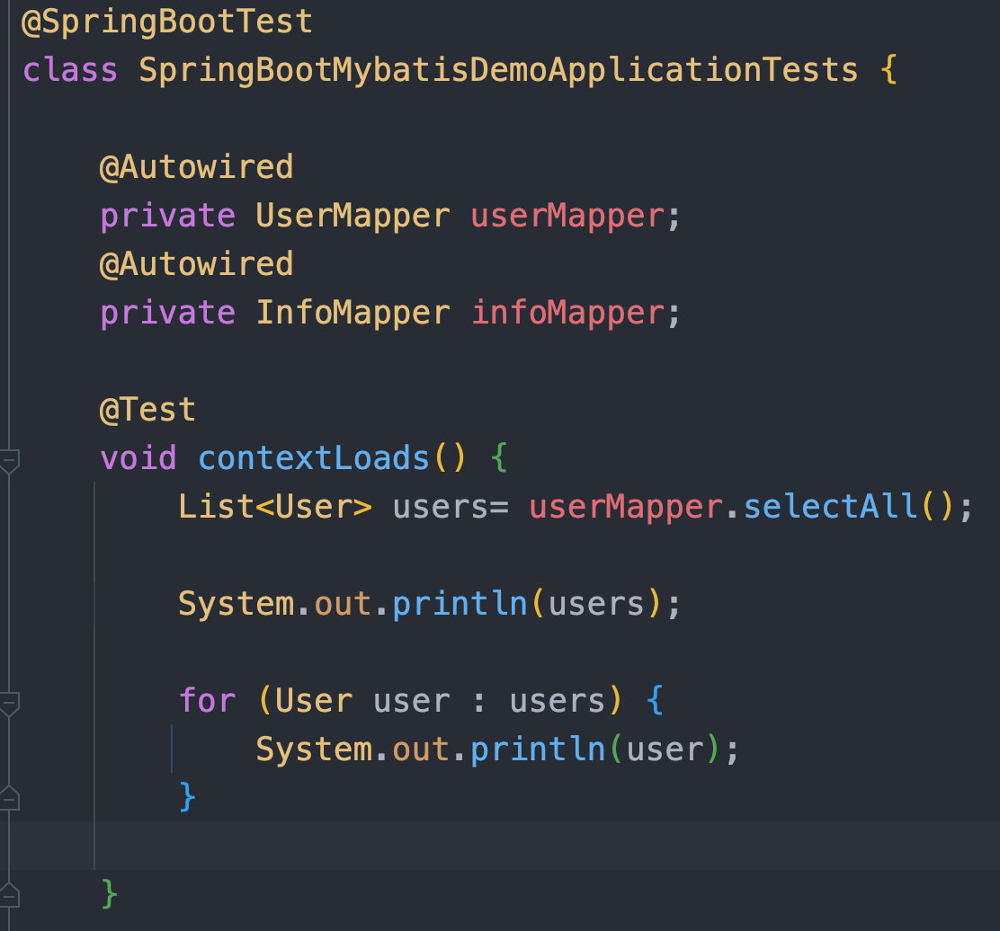
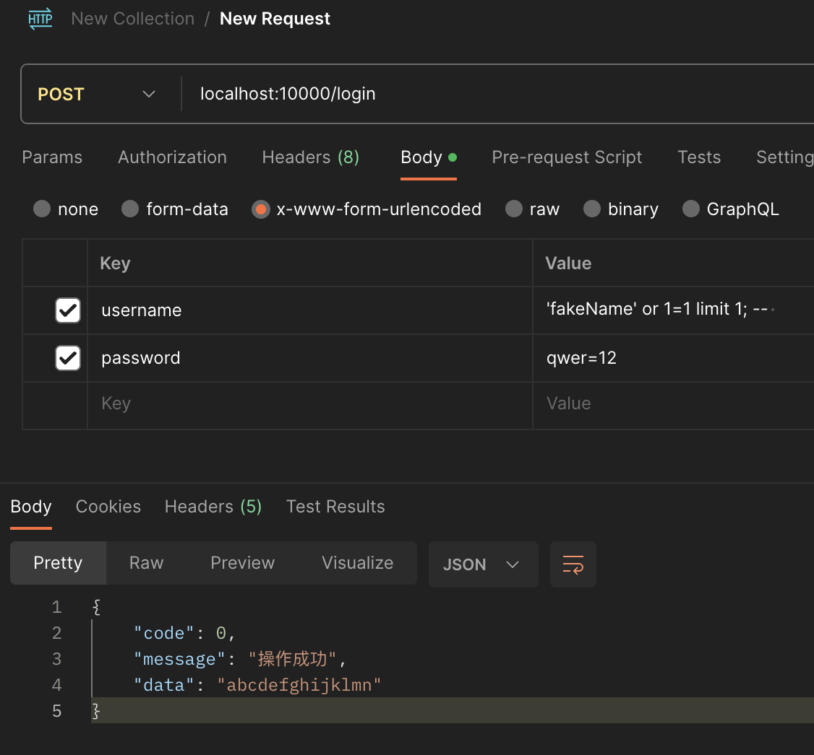
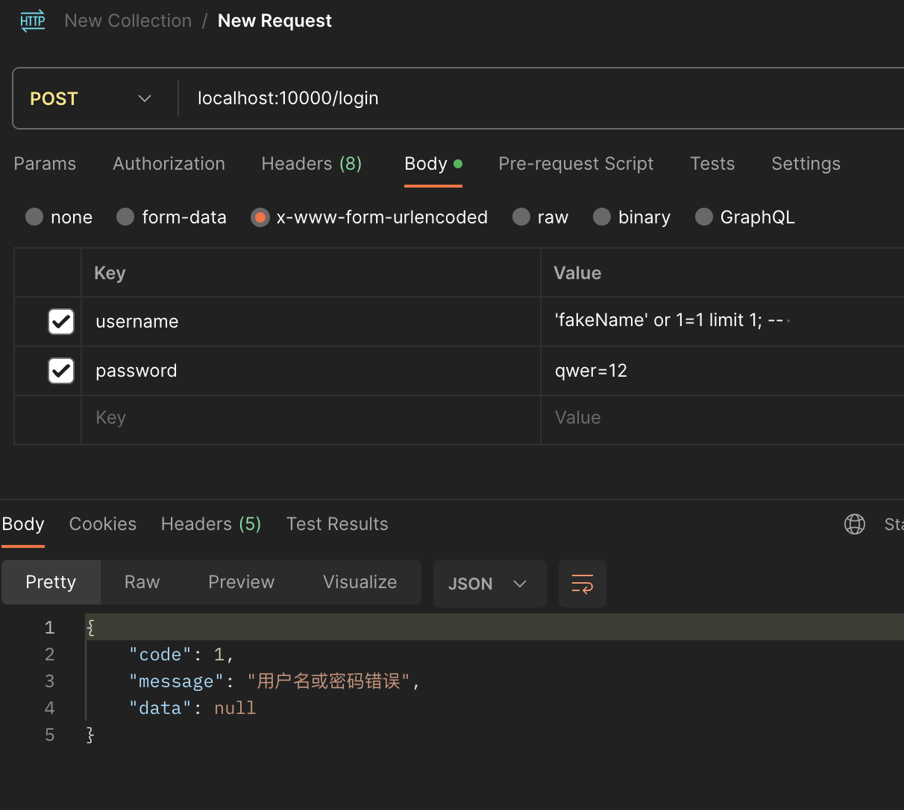

# 高级语言连接数据库

## 1. JDBC简述

### 1.1 jdbc查询操作（代码）

```java
@Test
    public void TestSelect() throws Exception {

        Class.forName("com.mysql.cj.jdbc.Driver");
        String url = "jdbc:mysql://localhost:3306/db_semi";
        String username = "roy";
        String password = "qwer=1234";
        Connection conn = DriverManager.getConnection(url, username, password);


        String sql = "select * from table01";

        Statement stmt = conn.createStatement();

        ResultSet resultSet = stmt.executeQuery(sql);
        //print result
        while (resultSet.next()) {
            System.out.print(resultSet.getInt("id") + "\t");
            System.out.print(resultSet.getString("username") + "\t");
            System.out.println(resultSet.getInt("age") + "\t");
        }
        
        stmt.close();
        conn.close();
    }
```


- JDBC的实现简单的查询操作需要大量的代码
- 虽然建立连接的代码很公式化，直接复制粘贴即可，但是在多个文件中使用同一个连接不方便
- 结构不清晰，不模块化，不优雅，手滑会把sql搞坏掉


## 2. mybatis

### 2.1 文件结构




```
src
├── main
│   ├── java
│   │   └── com
│   │       └── chennann
│   │           ├── mapper
│   │           │   └── userMapper.java
│   │           ├── pojo
│   │           │   └── User.java
│   │           ├── test01.java
│   │           └── test02.java
│   └── resources
│       ├── com
│       │   └── chennann
│       │       └── mapper
│       │           └── userMapper.xml
│       └── mybatis-config.xml
└── test
    └── java
```

- mapper文件的位置

  - 注意`userMapper.java`接口和`userMapper.xml`分别在相对于`java`和`resources`的同一个路径下

  - 这是为了在运行时两个文件在同一个文件夹下，并且保持稳健结构清晰，即***代码和配置文件分开存储***

- pojo
  - 一般来说需要定义对应的**pojo**(Plain Ordinary Java Object 简单java对象)，用来给sql传递参数、接收sql结果等等
  - pojo中的变量要和表中字段名对应（指对应字段名称一致）
- mybatis-config.xml
  - 可以看到和**JDBC**建立连接阶段一样的字符串
  - 但是配置文件还是很抽象
  - 还是很不好看
  - 还是很不优雅
  - 还是很容易写错

```xml
<?xml version="1.0" encoding="UTF-8" ?>
<!DOCTYPE configuration
        PUBLIC "-//mybatis.org//DTD Config 3.0//EN"
        "http://mybatis.org/dtd/mybatis-3-config.dtd">
<configuration>

    <typeAliases>
        <package name="com.chennann.pojo"/>
    </typeAliases>

    <!--
    environments：配置数据库连接环境信息。可以配置多个environment，通过default属性切换不同的environment
    -->
    <environments default="development">
        <environment id="development">
            <transactionManager type="JDBC"/>
            <dataSource type="POOLED">
                <!--数据库连接信息-->
                <property name="driver" value="com.mysql.cj.jdbc.Driver"/>
                <property name="url" value="jdbc:mysql:///db_semi?useSSL=false"/>
                <property name="username" value="roy"/>
                <property name="password" value="qwer=1234"/>
            </dataSource>
        </environment>
    </environments>
    <mappers>
        <package name="com.chennann.mapper"/>
    </mappers>
</configuration>
```

### 2.2 代码展示

***对应的mapper接口和xml文件这里不展示，等到后面springboot整合mybatis再展示***

#### 2.2.1 select

```java
public static void main(String[] args) throws IOException {

        String resource = "mybatis-config.xml";
        InputStream inputStream = Resources.getResourceAsStream(resource);
        SqlSessionFactory sqlSessionFactory = new SqlSessionFactoryBuilder().build(inputStream);

        SqlSession sqlSession = sqlSessionFactory.openSession();

        userMapper userMapper = sqlSession.getMapper(userMapper.class);
        List<User> users = userMapper.selectAll();

        for (User user : users) {
            System.out.println(user);
        }

        sqlSession.close();
    }
```


#### 2.2.2 insert

```java
public class test02 {
    public static void main(String[] args) throws IOException {
        String resource = "mybatis-config.xml";
        InputStream inputStream = Resources.getResourceAsStream(resource);
        SqlSessionFactory sqlSessionFactory = new SqlSessionFactoryBuilder().build(inputStream);

        SqlSession sqlSession = sqlSessionFactory.openSession(true);

        userMapper userMapper = sqlSession.getMapper(userMapper.class);

//        userMapper.addUserSimgleParam("qqq");

        userMapper.addUser("qwer", 20);

//        sqlSession.commit();
        sqlSession.close();
    }
}
```


### 2.3 底层参数传递规则

为什么要一个值对应两个键？（为了@param之后还能用param这一套统一的名字访问变量）


- 单个参数函数正常调用	✅

xml文件中正常编写sql，占位符中使用正确的变量名，可以正常执行插入操作

```xml
<insert id="addUserSimgleParam">
        insert into table01(username, age) values (#{username}, 23);
</insert>
```


- 单个参数函数参数名错误调用 ✅

xml文件中用任意变量名，依然可以正常执行插入操作

```xml
<insert id="addUserSimgleParam">
        insert into table01(username, age) values (#{name}, 23);
</insert>
```


- 两个参数函数正常调用 ❌

mapper接口中如果传入两个以上的参数，程序报错

```xml
<insert id="addUser">
        insert into table01(username, age) values (#{username}, #{age});
</insert>
```


- 查看报错信息

提示说可用的参数中没有`username`，只有`[arg1, arg0, param1, param2]`，这是为什么呢？


- 尝试arg0，param2 ✅

```xml
<insert id="addUser">
        insert into table01(username, age) values (#{arg0}, #{param2});
</insert>
```


- 用@param ✅

使用@param注解可以看到原先参数列表中的`arg0, arg1`被替换为`username, age`

而`param`系列的参数名依然存在


```xml
<insert id="addUser">
        insert into table01(username, age) values (#{username}, #{age});
</insert>
```

成功调整为很直觉的编码方式🏆


## 3. springboot整合mybatis

### 3.1 编码流程

1）在`pox.xml`中导入依赖坐标

```xml
<?xml version="1.0" encoding="UTF-8"?>
<project xmlns="http://maven.apache.org/POM/4.0.0" xmlns:xsi="http://www.w3.org/2001/XMLSchema-instance"
         xsi:schemaLocation="http://maven.apache.org/POM/4.0.0 https://maven.apache.org/xsd/maven-4.0.0.xsd">
    <modelVersion>4.0.0</modelVersion>
    <parent>
        <groupId>org.springframework.boot</groupId>
        <artifactId>spring-boot-starter-parent</artifactId>
        <version>3.1.5</version>
        <relativePath/> <!-- lookup parent from repository -->
    </parent>
    <groupId>com.chennann</groupId>
    <artifactId>SpringBootMybatisDemo</artifactId>
    <version>0.0.1-SNAPSHOT</version>
    <name>SpringBootMybatisDemo</name>
    <description>SpringBootMybatisDemo</description>
    <properties>
        <java.version>17</java.version>
    </properties>
    <dependencies>
        <dependency>
            <groupId>org.springframework.boot</groupId>
            <artifactId>spring-boot-starter-web</artifactId>
        </dependency>

        <dependency>
            <groupId>org.springframework.boot</groupId>
            <artifactId>spring-boot-starter-test</artifactId>
            <scope>test</scope>
        </dependency>


        <dependency>
            <groupId>org.mybatis.spring.boot</groupId>
            <artifactId>mybatis-spring-boot-starter</artifactId>
            <version>3.0.2</version>
        </dependency>

        <dependency>
            <groupId>com.mysql</groupId>
            <artifactId>mysql-connector-j</artifactId>
        </dependency>

        <dependency>
            <groupId>org.projectlombok</groupId>
            <artifactId>lombok</artifactId>
        </dependency>
    </dependencies>

    <build>
        <plugins>
            <plugin>
                <groupId>org.springframework.boot</groupId>
                <artifactId>spring-boot-maven-plugin</artifactId>
                <configuration>
                    <image>
                        <builder>paketobuildpacks/builder-jammy-base:latest</builder>
                    </image>
                </configuration>
            </plugin>
        </plugins>
    </build>

</project>

```


2）📖编写`application.yml`文件，加入mysql的配置项即可

```
spring:
  datasource:
    driver-class-name: com.mysql.cj.jdbc.Driver
    url: jdbc:mysql://localhost:3306/db_semi
    username: roy
    password: qwer=1234
```

🎉🎉输入配置项名称的部分字母就可以提示出完整的内容，而且层级格式自动对齐，真的就是🫱有手就行🫲


3）✍️按照mybatis的文件结构编写对应文件

这里给出完整的`InfoMapper.java`接口和`InfoMapper.xml`文件内容

```java
//InfoMapper.java
package com.chennann.springbootmybatisdemo.mapper;

import com.chennann.springbootmybatisdemo.pojo.Info;
import org.apache.ibatis.annotations.Delete;
import org.apache.ibatis.annotations.Insert;
import org.apache.ibatis.annotations.Mapper;
import org.apache.ibatis.annotations.Update;

import java.util.List;

@Mapper
public interface InfoMapper {

    @Insert("insert into info(xh, kh, cj) values (#{xh}, #{kh}, #{cj})")
    void addInfo(String xh, String kh, int cj);

    @Delete("delete from info where id = #{id}")
    void deleteInfo(int id);

    @Update("update info set cj = #{cj} where id = #{id} and kh = #{kh}")
    void updateInfo(int id, String kh, int cj);

    List<Info> WhereAndIf(Info info);

    List<Info> ChooseWhenOtherwise(int state);

    void ForeachTest(List<Info> list);

    void SetTest(int state);
}

```


```xml
<?xml version="1.0" encoding="UTF-8" ?>
<!DOCTYPE mapper
        PUBLIC "-//mybatis.org//DTD Mapper 3.0//EN"
        "http://mybatis.org/dtd/mybatis-3-mapper.dtd">
<mapper namespace="com.chennann.springbootmybatisdemo.mapper.InfoMapper">
    <insert id="ForeachTest">
        insert into info(xh,kh,cj) values
        <foreach collection="list" item="info" separator=",">
            (#{info.xh},#{info.kh},#{info.cj})
        </foreach>
    </insert>
    <update id="SetTest">
        update info
        <set>
            <if test="state == 1">
                cj = 1.05* cj
            </if>
            <if test="state != 1">
                cj = 0.95* cj
            </if>
        </set>
    </update>

    <select id="WhereAndIf" resultType="com.chennann.springbootmybatisdemo.pojo.Info">
        select * from info
        <where>
            <if test="xh != null">
                and xh = #{xh}
            </if>
            <if test="kh != null">
                and kh = #{kh}
            </if>
            <if test="cj != null">
                and cj = #{cj}
            </if>
        </where>
    </select>
    <select id="ChooseWhenOtherwise" resultType="com.chennann.springbootmybatisdemo.pojo.Info">
        select * from info
        <where>
            <choose>
                <when test="state == 1">
                    and cj = 100
                </when>
                <when test="state == 2">
                    and cj &lt;  60
                </when>
                <otherwise>
                    and cj > 60
                </otherwise>
            </choose>
        </where>
    </select>
</mapper>
```

⚠️需要注意`namespace`要和对应的mapper文件路径对应⚠️

***借助`mybatisX`插件可以实现快速创建sql标签***

4）编写测试代码

用`@Autowired`注解注入mapper对象，之后就可以正常在代码中使用mapper对象的方法，并且有智能提示




5）在测试代码中用mapper对象调用需要的功能（可以是还没有实现的功能）

6）跟着报错提示❌一步一步完整代码，直到编写完sql（直接用注解或者编写xml文件）

7）运行代码🚀


### 3.2 对照mybatis省略了哪些代码

- 省去了打开连接，关闭连接等重复性的代码
- 优化了配置写法
- 搭配idea有更多智能提示，提高效率
- 配置内容统一地存放在一个地方，方便管理，模块清晰，很优雅💅

==直接代码展示==


### 3.3 动态sql

==代码运行展示==

#### 3.3.1 `<where>`和`<if>`

按照传入参数动态查询信息

```xml
<select id="WhereAndIf" resultType="com.chennann.springbootmybatisdemo.pojo.Info">
        select * from info
        <where>
            <if test="xh != null">
                and xh = #{xh}
            </if>
            <if test="kh != null">
                and kh = #{kh}
            </if>
            <if test="cj != null">
                and cj = #{cj}
            </if>
        </where>
</select>
```


#### 3.3.2 `<choose>`,`<when>`和`otherwise`

- `state == 1`查询满分同学
- `state == 2`查询不及格同学
- `state == other`查询及格同学

```xml
<select id="ChooseWhenOtherwise" resultType="com.chennann.springbootmybatisdemo.pojo.Info">
        select * from info
        <where>
            <choose>
                <when test="state == 1">
                    and cj = 100
                </when>
                <when test="state == 2">
                    and cj &lt;  60
                </when>
                <otherwise>
                    and cj > 60
                </otherwise>
            </choose>
        </where>
</select>
```


#### 3.3.3 `<foreach>`

传入一个`List<Info>`， 遍历插入数据表

```xml
<insert id="ForeachTest">
        insert into info(xh,kh,cj) values
        <foreach collection="list" item="info" separator=",">
            (#{info.xh},#{info.kh},#{info.cj})
        </foreach>
</insert>
```


#### 3.3.4 `<set>`

根据传入状态更新数据表。

- `state == 1`成绩上涨5%
- `state != 1`成绩减少5%

```xml
<update id="SetTest">
        update info
        <set>
            <if test="state == 1">
                cj = 1.05* cj
            </if>
            <if test="state != 1">
                cj = 0.95* cj
            </if>
        </set>
</update>
```


#### *3.3.5 `<bind>`


#### *3.3.6 `trim`


### 3.4 sql注入

mybatis中有两种动态的sql语句替换写法：` ${}` 和 `#{}`

#### 1) `${}`：文本替换

- **作用**：`${}` 直接将参数的值替换到 SQL 语句中，它更像是一个简单的字符串替换。
- **安全性**：使用 `${}` 可能导致 SQL 注入风险，因为它直接将参数的值拼接到 SQL 语句中。如果参数内容包含恶意的 SQL 代码，它将被执行。
- **使用场景**：通常只在参数不由用户直接提供，或者在动态 SQL 情况下（如动态表名、列名、或其他 SQL 片段），且开发者能完全控制和确保参数值的安全性时，才使用 `${}`。


如果用`${}`编写sql，如下所示：

```java
@Select("select * from user where username = ${username} and password = ${password}")
User findUserByUsernameAndPassword(String username, String password);
```


🦹不怀好意的人知道了你的危险写法，并且发送了这样的网络请求：

正确的用户名：chennann

正确的密码：qwer=1234



**那么你就爆炸了💥🤯💣**


- 他绕过了账号密码验证，直接获得了有效的`token`
- 也就是说他可以拿着这个`token`在你的系统里为所欲为
- 而且各种行为看起来都是合法的，没有理由收回`token`


#### 2) `#{}`：参数占位符

- **作用**：`#{}` 用于预处理语句（Prepared Statement）中，它通过预处理机制传递参数。
- **安全性**：使用 `#{}` 可以防止 SQL 注入，因为 MyBatis 会将参数的值作为一个绑定变量传递给 SQL 语句。这意味着参数值在 SQL 语句执行之前已经被设定，无法被篡改。
- **使用场景**：当需要安全地传递参数到 SQL 语句中时，应该使用 `#{}`。



使用`#{}`可以避免上述的sql注入问题。

```java
@Select("select * from user where username = #{username} and password = #{password}")
User findUserByUsernameAndPassword(String username, String password);
```


